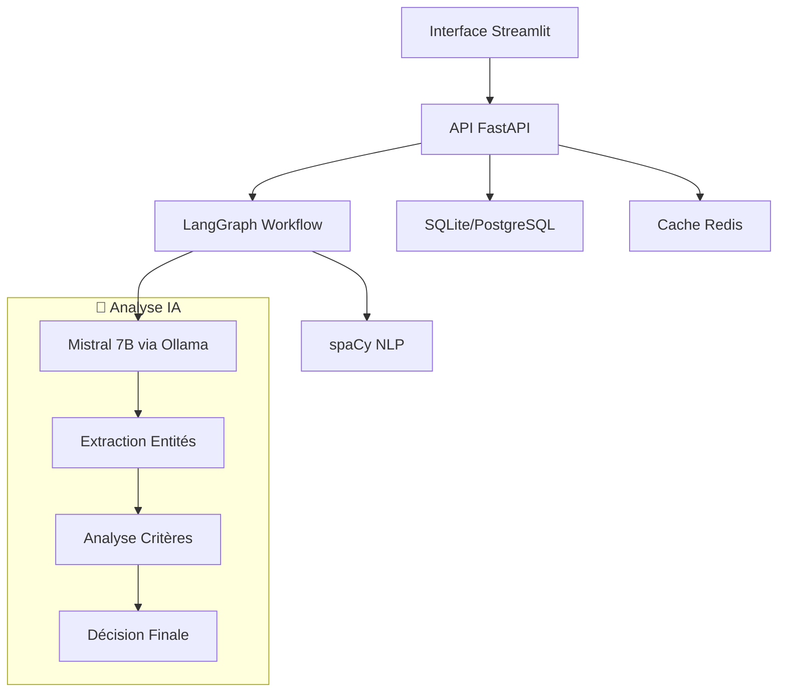
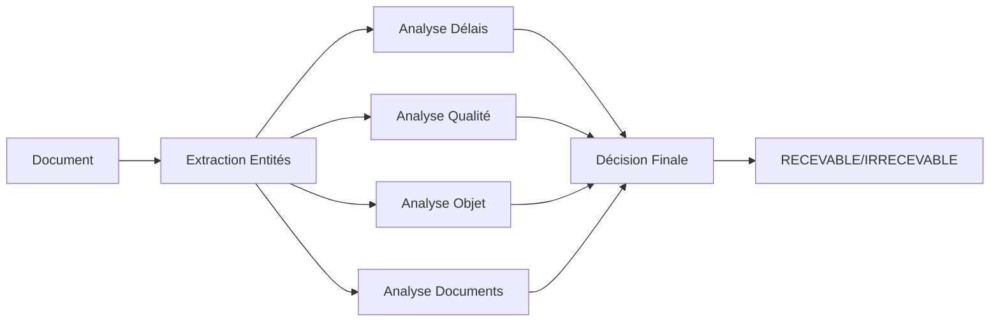

# 🏛️ SAC-DJ - Système d'Analyse Cognitive pour Dossiers Juridiques

[](https://python.org)
[](https://fastapi.tiangolo.com)
[](https://streamlit.io)
[](https://langchain-ai.github.io/langgraph)
[](https://mistral.ai)

> Assistant d'analyse augmentée pour dossiers juridiques CSPE utilisant l'intelligence artificielle

## 🎯 Vue d'Ensemble

SAC-DJ est un système intelligent d'analyse de documents juridiques qui automatise la classification des recours CSPE (Commission de Régulation de l'Énergie). Il utilise **Mistral 7B** via **Ollama** et **LangGraph** pour analyser automatiquement les 4 critères de recevabilité.

### ✨ Fonctionnalités Principales

- 🤖 **Analyse IA Complète** : Classification automatique RECEVABLE/IRRECEVABLE
- ⚖️ **4 Critères CSPE** : Délais, Qualité pour agir, Objet du recours, Pièces justificatives
- 🔍 **Extraction d'Entités** : Dates, demandeur, objet, montant automatiquement extraits
- ✅ **Validation Humaine** : Workflow de révision par les experts juridiques
- 📊 **Analytics Avancés** : Métriques, tendances et tableaux de bord
- 🌐 **Interface Moderne** : Interface web Streamlit intuitive
- 🔐 **Authentification** : Gestion des utilisateurs et rôles
- 📄 **Multi-formats** : Support PDF, DOCX, TXT

## 🏗️ Architecture Technique



### 🛠️ Stack Technologique

| Composant | Technologie | Version | Rôle |
|-----------|-------------|---------|------|
| **Frontend** | Streamlit | 1.35.0 | Interface utilisateur |
| **Backend** | FastAPI | 0.111.0 | API REST |
| **IA Core** | LangGraph | 0.0.63 | Orchestration workflow |
| **LLM** | Mistral | 7B-instruct | Analyse juridique |
| **Moteur IA** | Ollama | Latest | Hébergement LLM local |
| **NLP** | spaCy | 3.7.4 | Extraction d'entités |
| **Base de Données** | SQLite/PostgreSQL | 2.0.30 | Persistance |
| **Cache** | Redis | 7+ | Performance (optionnel) |

## 🚀 Installation Express (Windows)

### ⚡ Démarrage en 5 minutes

```bash
# 1. Cloner le projet
git clone https://github.com/votre-username/sac-dj.git
cd sac-dj

# 2. Installation automatique
setup.bat

# 3. Démarrer tous les services
start_all.bat
```

**C'est tout !** 🎉 

- **Interface :** http://localhost:8501
- **API :** http://localhost:8000/docs
- **Connexion :** admin@test.com / admin123

### 📋 Prérequis

| Logiciel | Version | Lien |
|----------|---------|------|
| **Python** | 3.11+ | [python.org](https://python.org/downloads) |
| **Git** | Latest | [git-scm.com](https://git-scm.com/downloads) |
| **Ollama** | Latest | [ollama.ai](https://ollama.ai/download) |

## 📖 Installation Détaillée

### 1️⃣ Cloner et Configurer

```bash
git clone https://github.com/votre-username/sac-dj.git
cd sac-dj
```

### 2️⃣ Installation des Dépendances

```bash
# Exécuter le script d'installation
setup.bat

# OU manuellement :
python -m venv venv
venv\Scripts\activate
pip install -r requirements.txt
python -m spacy download fr_core_news_lg
copy .env.example .env
python init_db.py
```

### 3️⃣ Configuration d'Ollama

```bash
# Terminal 1 : Démarrer Ollama
start_ollama.bat

# Terminal 2 : Installer Mistral
install_model.bat
```

### 4️⃣ Démarrage des Services

```bash
# Méthode 1 : Tout en un
start_all.bat

# Méthode 2 : Service par service
start_api.bat      # Terminal 3
start_frontend.bat # Terminal 4
```

## 🎮 Utilisation

### 🔐 Connexion

1. Ouvrez http://localhost:8501
2. Connectez-vous avec :
   - **Email :** `admin@test.com`
   - **Mot de passe :** `admin123`

### 📄 Analyser un Document

1. **Upload :** Glissez-déposez votre document (PDF, DOCX, TXT)
2. **Analyse :** Cliquez sur "🚀 Lancer l'Analyse"
3. **Résultats :** Obtenez la classification en 1-2 minutes
4. **Validation :** Les experts peuvent réviser si nécessaire

### 📊 Dashboard et Analytics

- **📊 Dashboard :** Vue d'ensemble des métriques
- **📈 Analytics :** Tendances et performance
- **✅ Validation :** Queue de révision humaine
- **⚙️ Paramètres :** Configuration du système

## 🧠 Comment ça Marche

### 🔄 Workflow d'Analyse



### 🏷️ Critères Analysés

| Critère | Description | IA | Validation |
|---------|-------------|-----|------------|
| **⏰ Délais** | Recours dans les 2 mois | ✅ Auto | 🔍 Si doute |
| **👤 Qualité** | Demandeur directement concerné | ✅ Auto | 🔍 Si doute |
| **📋 Objet** | Contestation claire et précise | ✅ Auto | 🔍 Si doute |
| **📎 Documents** | Pièces justificatives complètes | ✅ Auto | 🔍 Si doute |

### 📊 Scores de Confiance

- **🟢 90-100%** : Décision automatique fiable
- **🟡 70-89%** : Validation humaine recommandée  
- **🔴 <70%** : Révision humaine obligatoire

## 🔧 Scripts Utiles

| Script | Description | Usage |
|--------|-------------|-------|
| `setup.bat` | Installation complète | Une seule fois |
| `start_all.bat` | Démarre tout | Utilisation normale |
| `start_ollama.bat` | Ollama uniquement | Service IA |
| `start_api.bat` | API uniquement | Backend |
| `start_frontend.bat` | Interface uniquement | Frontend |
| `install_model.bat` | Télécharge Mistral | Première fois |
| `check_status.bat` | Vérifie tout | Diagnostic |
| `validate_system.py` | Tests complets | Validation |

## 🐛 Dépannage

### ❌ Problèmes Courants

| Problème | Solution |
|----------|----------|
| **Python non reconnu** | Ajouter Python au PATH Windows |
| **Ollama ne démarre pas** | Vérifier port 11434 libre |
| **API ne répond pas** | Vérifier port 8000 libre |
| **Modèle Mistral manquant** | Exécuter `install_model.bat` |
| **Erreur de dépendances** | Réinstaller : `pip install -r requirements.txt` |

### 🔍 Diagnostic Rapide

```bash
# Vérifier l'état de tous les composants
check_status.bat

# Tests complets du système
python validate_system.py

# Logs détaillés
# Consultez les terminaux start_api.bat et start_frontend.bat
```

### 🆘 Health Checks

| Service | URL | Status |
|---------|-----|--------|
| **API** | http://localhost:8000/health | JSON de santé |
| **Ollama** | http://localhost:11434 | "Ollama is running" |
| **Interface** | http://localhost:8501 | Page de connexion |

## 🚀 Performance

### 📊 Métriques Typiques

- **Temps d'analyse :** 30-90 secondes
- **Précision IA :** 94-97%
- **Débit :** 100+ documents/heure
- **Ressources :** 6-8 GB RAM

### ⚡ Optimisations

- **GPU :** Support NVIDIA pour Ollama (optionnel)
- **Cache :** Redis pour les analyses répétées
- **Parallélisation :** Analyse des 4 critères simultanément
- **Streaming :** Réponses en temps réel

## 🛡️ Sécurité

### 🔐 Fonctionnalités

- **Authentification JWT** : Tokens sécurisés
- **Rôles utilisateurs** : Admin, Expert, Agent
- **Chiffrement** : Mots de passe hashés (bcrypt)
- **Validation** : Inputs sanitisés
- **Logs** : Traçabilité complète

### 🏠 Déploiement Local

- **Données locales** : Aucune donnée externe
- **IA on-premise** : Mistral via Ollama local
- **RGPD compliant** : Pas de transfert vers le cloud

## 📚 Documentation

### 📖 Guides

- **[Guide de Démarrage](GUIDE_DEMARRAGE_WINDOWS.md)** : Installation pas à pas
- **[Documentation API](http://localhost:8000/docs)** : Endpoints interactifs
- **[Architecture](docs/architecture.md)** : Détails techniques
- **[Déploiement](docs/deployment.md)** : Production

### 🔗 Liens Utiles

- **Interface :** http://localhost:8501
- **API Docs :** http://localhost:8000/docs
- **Health Check :** http://localhost:8000/health
- **Ollama :** http://localhost:11434

## 🤝 Contribution

### 🔄 Workflow de Développement

```bash
# 1. Forker le projet
git fork https://github.com/original/sac-dj.git

# 2. Créer une branche
git checkout -b feature/nouvelle-fonctionnalite

# 3. Développer et tester
python validate_system.py

# 4. Commiter et pousser
git commit -m "feat: ajouter nouvelle fonctionnalité"
git push origin feature/nouvelle-fonctionnalite

# 5. Créer une Pull Request
```

### 🧪 Tests

```bash
# Tests unitaires
python -m pytest tests/

# Tests d'intégration
python tests/test_basic.py

# Validation complète
python validate_system.py
```

## 📈 Roadmap

### 🎯 Version 1.1 (Q2 2024)

- [ ] Support multi-juridictions
- [ ] API GraphQL
- [ ] Export avancé (Excel, PDF)
- [ ] Notifications temps réel

### 🎯 Version 1.2 (Q3 2024)

- [ ] Interface mobile
- [ ] Analytics prédictifs
- [ ] Modèle IA personnalisé
- [ ] Intégration ERP juridique

## 📄 Licence

Ce projet est sous licence **MIT**. Voir le fichier [LICENSE](LICENSE) pour plus de détails.

## 🙏 Remerciements

- **[Mistral AI](https://mistral.ai)** pour le modèle de langage
- **[Ollama](https://ollama.ai)** pour l'hébergement local des LLM
- **[LangChain](https://langchain.com)** pour les outils d'IA
- **[FastAPI](https://fastapi.tiangolo.com)** pour le framework web
- **[Streamlit](https://streamlit.io)** pour l'interface utilisateur

## 📞 Support

- **🐛 Issues :** [GitHub Issues](https://github.com/votre-username/sac-dj/issues)
- **💬 Discussions :** [GitHub Discussions](https://github.com/votre-username/sac-dj/discussions)
- **📧 Contact :** votre.email@exemple.com

---

<div align="center">
  <strong>🏛️ SAC-DJ - Intelligence Artificielle au Service de la Justice</strong><br>
  <em>Développé avec ❤️ pour moderniser l'analyse juridique</em>
</div>